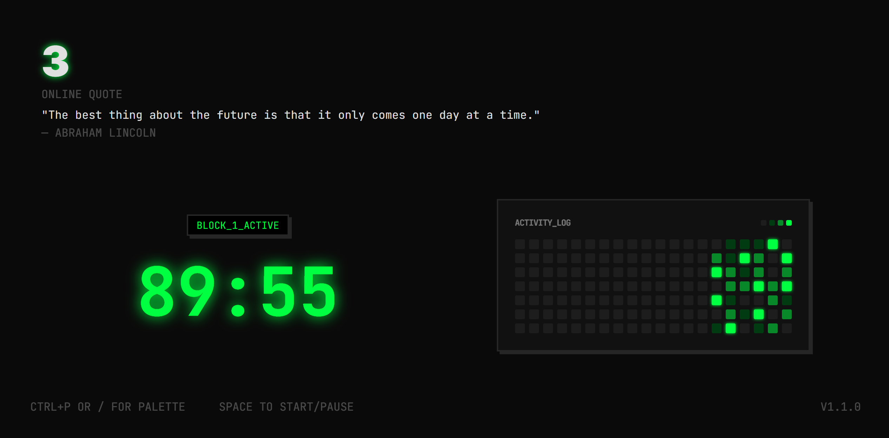

# 3

This is a system I use to be more consistent about deep work. I try to do 3 90 minute sessions a day.



## Setup & Build

### Prerequisites
- [Node.js](https://nodejs.org/) installed on your machine.

### Installation
```bash
# Install dependencies
npm install
```

### Development
```bash
# Start the development server
npm run dev
```

### Build
```bash
# Build the project
npm run build
```
This project uses `vite-plugin-singlefile`, so the build will output a single, portable HTML file in the `dist/` directory.